# lesson 02 作业

## 1. 环境
|地址|CPU|内存|硬盘|
|-|-|-|-|
|172.19.215.79|8核|16GB|SSD 180GB|
|172.19.215.77|8核|16GB|SSD 180GB|
|172.19.215.76|8核|16GB|SSD 180GB|
|172.19.215.83|8核|16GB|SSD 40GB|
|172.19.215.82|8核|16GB|SSD 40GB|

另外:
  `172.19.215.85` 4核4GB 作为施压机

## 2. 安装 tiup
```shell
$ curl --proto '=https' --tlsv1.2 -sSf https://tiup-mirrors.pingcap.com/install.sh | sh
$ source .profile
```
### tiup 拓扑配置
```yaml
global:
  user: "tidb"
  ssh_port: 22
  deploy_dir: "/tidb-deploy"
  data_dir: "/tidb-data"

pd_servers:
  - host: 172.19.215.79  # 8核 | 16GB | SSD 180GB
  - host: 172.19.215.77  # 8核 | 16GB | SSD 180GB
  - host: 172.19.215.76  # 8核 | 16GB | SSD 180GB

tidb_servers:
  - host: 172.19.215.83 # 8核 | 16GB | SSD 40GB
  - host: 172.19.215.82 # 8核 | 16GB | SSD 40GB

tikv_servers:
  - host: 172.19.215.79  # 8核 | 16GB | SSD 180GB
  - host: 172.19.215.77  # 8核 | 16GB | SSD 180GB
  - host: 172.19.215.76  # 8核 | 16GB | SSD 180GB

monitoring_servers:
  - host: 172.19.215.85  # 4核 | 4GB | SSD 40GB

grafana_servers:
  - host: 172.19.215.85  # 4核 | 4GB | SSD 40GB

alertmanager_servers:
  - host: 172.19.215.85  # 4核 | 4GB | SSD 40GB
```

### 部署集群
```shell
$ tiup cluster deploy tidb-test v4.0.0 ./topology.yaml --user root -p
```
### 启动集群
```shell
$ tiup cluster start tidb-test
```

### 查看集群状态
```sheel
$ tiup cluster display tidb-test
Starting component `cluster`: /root/.tiup/components/cluster/v1.0.9/tiup-cluster display tidb-test
tidb Cluster: tidb-test
tidb Version: v4.0.0
ID                   Role          Host           Ports        OS/Arch       Status  Data Dir                      Deploy Dir
--                   ----          ----           -----        -------       ------  --------                      ----------
172.19.215.85:9093   alertmanager  172.19.215.85  9093/9094    linux/x86_64  Up      /tidb-data/alertmanager-9093  /tidb-deploy/alertmanager-9093
172.19.215.85:3000   grafana       172.19.215.85  3000         linux/x86_64  Up      -                             /tidb-deploy/grafana-3000
172.19.215.76:2379   pd            172.19.215.76  2379/2380    linux/x86_64  Up|UI   /tidb-data/pd-2379            /tidb-deploy/pd-2379
172.19.215.77:2379   pd            172.19.215.77  2379/2380    linux/x86_64  Up|L    /tidb-data/pd-2379            /tidb-deploy/pd-2379
172.19.215.79:2379   pd            172.19.215.79  2379/2380    linux/x86_64  Up      /tidb-data/pd-2379            /tidb-deploy/pd-2379
172.19.215.85:9090   prometheus    172.19.215.85  9090         linux/x86_64  Up      /tidb-data/prometheus-9090    /tidb-deploy/prometheus-9090
172.19.215.82:4000   tidb          172.19.215.82  4000/10080   linux/x86_64  Up      -                             /tidb-deploy/tidb-4000
172.19.215.83:4000   tidb          172.19.215.83  4000/10080   linux/x86_64  Up      -                             /tidb-deploy/tidb-4000
172.19.215.76:20160  tikv          172.19.215.76  20160/20180  linux/x86_64  Up      /tidb-data/tikv-20160         /tidb-deploy/tikv-20160
172.19.215.77:20160  tikv          172.19.215.77  20160/20180  linux/x86_64  Up      /tidb-data/tikv-20160         /tidb-deploy/tikv-20160
172.19.215.79:20160  tikv          172.19.215.79  20160/20180  linux/x86_64  Up      /tidb-data/tikv-20160         /tidb-deploy/tikv-20160

```

## 3. 部署 haproxy
#### 这里我把 haproxy 部署在 172.19.215.83 (和其中一台tidb同机器)

### 安装 haproxy
```shell
$ apt install haproxy
```

### haproxy 配置
```yml
# /etc/haproxy/haproxy.cfg
global                                     # 全局配置。
   log         127.0.0.1 local2            # 定义全局的 syslog 服务器，最多可以定义两个。
   chroot      /var/lib/haproxy            # 更改当前目录并为启动进程设置超级用户权限，从而提高安全性。
   pidfile     /var/run/haproxy.pid        # 将 HAProxy 进程的 PID 写入 pidfile。
   maxconn     4000                        # 每个 HAProxy 进程所接受的最大并发连接数。
   user        haproxy                     # 同 UID 参数。
   group       haproxy                     # 同 GID 参数，建议使用专用用户组。
   nbproc      40                          # 在后台运行时创建的进程数。在启动多个进程转发请求时，确保该值足够大，保证 HAProxy 不会成为瓶颈。
   daemon                                  # 让 HAProxy 以守护进程的方式工作于后台，等同于命令行参数“-D”的功能。当然，也可以在命令行中用“-db”参数将其禁用。
   stats socket /var/lib/haproxy/stats     # 统计信息保存位置。

defaults                                   # 默认配置。
   log global                              # 日志继承全局配置段的设置。
   retries 2                               # 向上游服务器尝试连接的最大次数，超过此值便认为后端服务器不可用。
   timeout connect  2s                     # HAProxy 与后端服务器连接超时时间。如果在同一个局域网内，可设置成较短的时间。
   timeout client 30000s                   # 客户端与 HAProxy 连接后，数据传输完毕，即非活动连接的超时时间。
   timeout server 30000s                   # 服务器端非活动连接的超时时间。

listen admin_stats                         # frontend 和 backend 的组合体，此监控组的名称可按需进行自定义。
   bind 0.0.0.0:8080                       # 监听端口。
   mode http                               # 监控运行的模式，此处为 `http` 模式。
   option httplog                          # 开始启用记录 HTTP 请求的日志功能。
   maxconn 10                              # 最大并发连接数。
   stats refresh 30s                       # 每隔 30 秒自动刷新监控页面。
   stats uri /haproxy                      # 监控页面的 URL。
   stats realm HAProxy                     # 监控页面的提示信息。
   stats auth admin:admin123               # 监控页面的用户和密码，可设置多个用户名。
   stats hide-version                      # 隐藏监控页面上的 HAProxy 版本信息。
   stats  admin if TRUE                    # 手工启用或禁用后端服务器（HAProxy 1.4.9 及之后版本开始支持）。

listen tidb-cluster                        # 配置 database 负载均衡。
   bind 0.0.0.0:3390                       # 浮动 IP 和 监听端口。
   mode tcp                                # HAProxy 要使用第 4 层的传输层。
   balance leastconn                       # 连接数最少的服务器优先接收连接。`leastconn` 建议用于长会话服务，例如 LDAP、SQL、TSE 等，而不是短会话协议，如 HTTP。该算法是动态的，对于启动慢的服务器，服务器权重会在运行中作调整。
   server tidb-1 172.19.215.83:4000 check inter 2000 rise 2 fall 3       # 检测 4000 端口，检测频率为每 2000 毫秒一次。如果 2 次检测为成功，则认为服务器可用；如果 3 次检测为失败，则认为服务器不可用。
   server tidb-2 172.19.215.82:4000 check inter 2000 rise 2 fall 3
```

### 启动 haproxy
```shell
$ haproxy -f /etc/haproxy/haproxy.cfg
```

<center>haproxy admin</center>

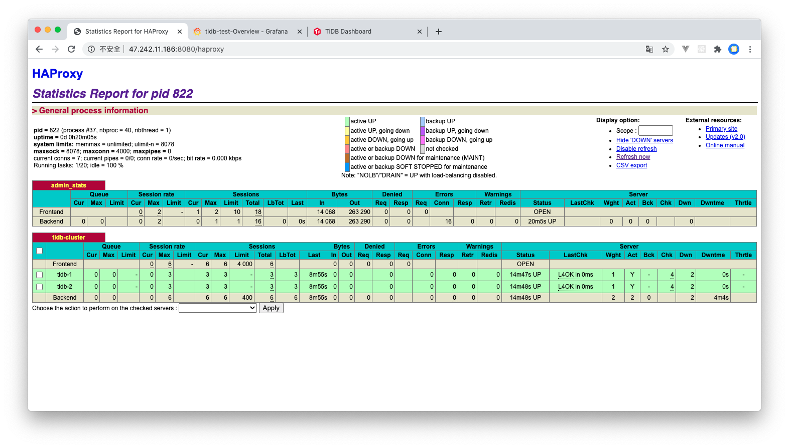


<center>grafana</center>

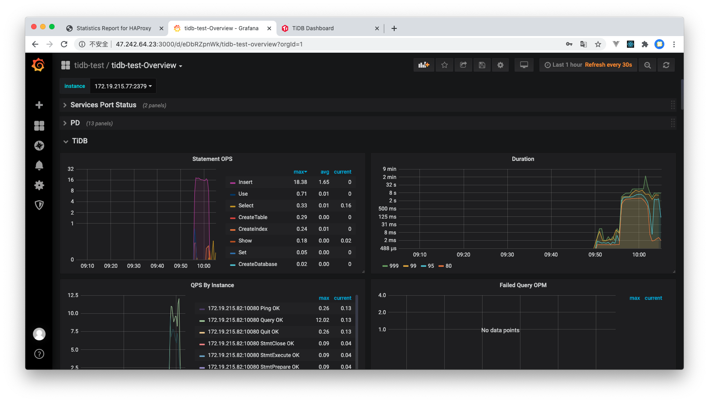


<center>dashboard</center>

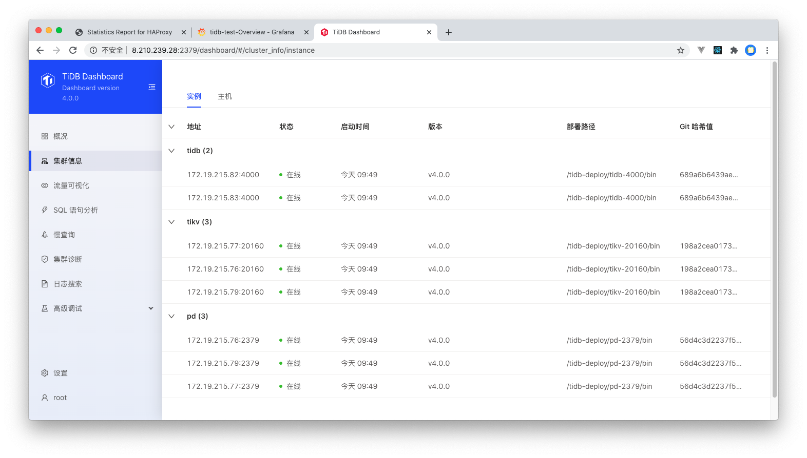


## 4. 使用 sysbench 做性能测试

### sysbench 配置文件
```properties
# config
mysql-host=172.19.215.83
mysql-port=3390
mysql-user=root
mysql-password=
mysql-db=sbtest
time=600
threads=16
report-interval=10
db-driver=mysql
```

### 创建数据库 设置为乐观锁模式
```sql
mysql> create database sbtest;
# 设置为乐观锁模式
mysql> set global tidb_disable_txn_auto_retry = off;
mysql> set global tidb_txn_mode="optimistic";
```

### 导入数据
```shell
$ nohup  sysbench  --config-file=config  oltp_point_select  --threads=32  --tables=32  --table-size=500000  prepare  2>&1  &
```
32 张表 每张表 500000 条记录.

### 设置回悲观锁模式
```sql
mysql> set global tidb_txn_mode="pessimistic";
```

### 执行 oltp_point_select
```shell
$ sysbench --config-file=config oltp_point_select --threads=256 --tables=32 --table-size=500000 run
sysbench 1.0.20 (using bundled LuaJIT 2.1.0-beta2)

Running the test with following options:
Number of threads: 256
Report intermediate results every 10 second(s)
Initializing random number generator from current time


Initializing worker threads...

Threads started!

[ 10s ] thds: 256 tps: 97824.44 qps: 97824.44 (r/w/o: 97824.44/0.00/0.00) lat (ms,95%): 7.56 err/s: 0.00 reconn/s: 0.00
......
......
......
[ 600s ] thds: 256 tps: 100895.50 qps: 100895.50 (r/w/o: 100895.50/0.00/0.00) lat (ms,95%): 7.56 err/s: 0.00 reconn/s: 0.00
SQL statistics:
    queries performed:
        read:                            59877742
        write:                           0
        other:                           0
        total:                           59877742
    transactions:                        59877742 (99784.17 per sec.)
    queries:                             59877742 (99784.17 per sec.)
    ignored errors:                      0      (0.00 per sec.)
    reconnects:                          0      (0.00 per sec.)

General statistics:
    total time:                          600.0709s
    total number of events:              59877742

Latency (ms):
         min:                                    0.26
         avg:                                    2.56
         max:                                   70.44
         95th percentile:                        7.56
         sum:                            153560212.24

Threads fairness:
    events (avg/stddev):           233897.4297/100182.89
    execution time (avg/stddev):   599.8446/0.11
```
<center>oltp_point_select 运行时机器负载</center>

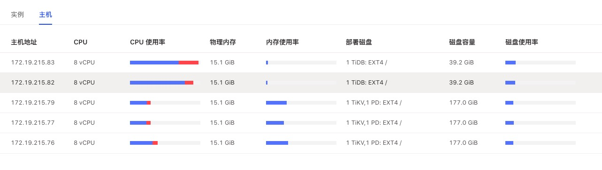

<center>oltp_point_select tidb 指标</center>

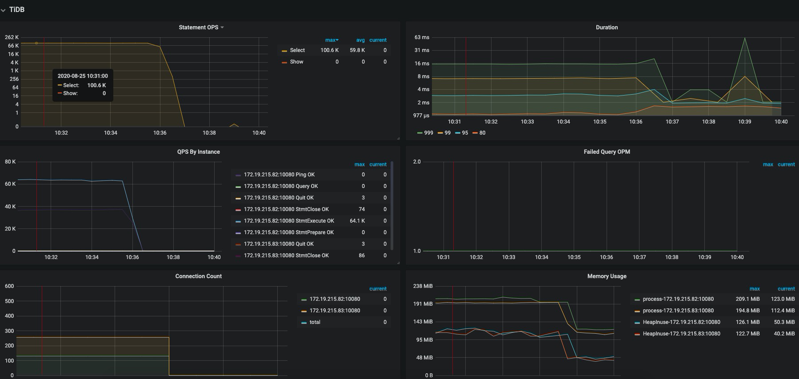

<center>oltp_point_select tikv 指标</center>

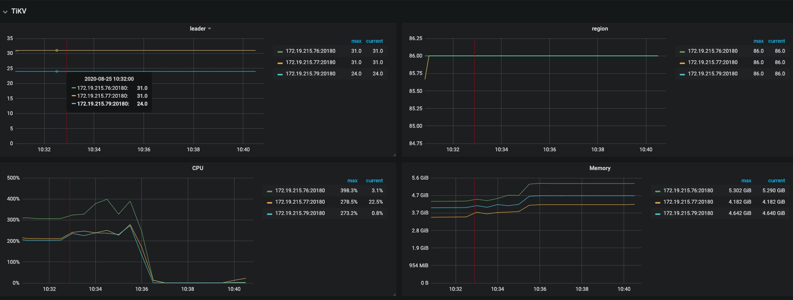


### 执行 oltp_update_index
```shell
$ sysbench --config-file=config oltp_update_index --threads=256 --tables=32 --table-size=500000 run
sysbench 1.0.20 (using bundled LuaJIT 2.1.0-beta2)

Running the test with following options:
Number of threads: 256
Report intermediate results every 10 second(s)
Initializing random number generator from current time


Initializing worker threads...

Threads started!

[ 10s ] thds: 256 tps: 13514.11 qps: 13514.11 (r/w/o: 0.00/13503.01/11.10) lat (ms,95%): 22.28 err/s: 0.00 reconn/s: 0.00
......
......
......
[ 600s ] thds: 256 tps: 7272.17 qps: 7272.17 (r/w/o: 0.00/7266.17/6.00) lat (ms,95%): 167.44 err/s: 0.00 reconn/s: 0.00
SQL statistics:
    queries performed:
        read:                            0
        write:                           6248579
        other:                           4455
        total:                           6253034
    transactions:                        6253034 (10420.62 per sec.)
    queries:                             6253034 (10420.62 per sec.)
    ignored errors:                      0      (0.00 per sec.)
    reconnects:                          0      (0.00 per sec.)

General statistics:
    total time:                          600.0616s
    total number of events:              6253034

Latency (ms):
         min:                                    0.44
         avg:                                   24.56
         max:                                 3857.71
         95th percentile:                       35.59
         sum:                            153603506.56

Threads fairness:
    events (avg/stddev):           24425.9141/283.17
    execution time (avg/stddev):   600.0137/0.02
```
<center>oltp_update_index tidb 指标</center>

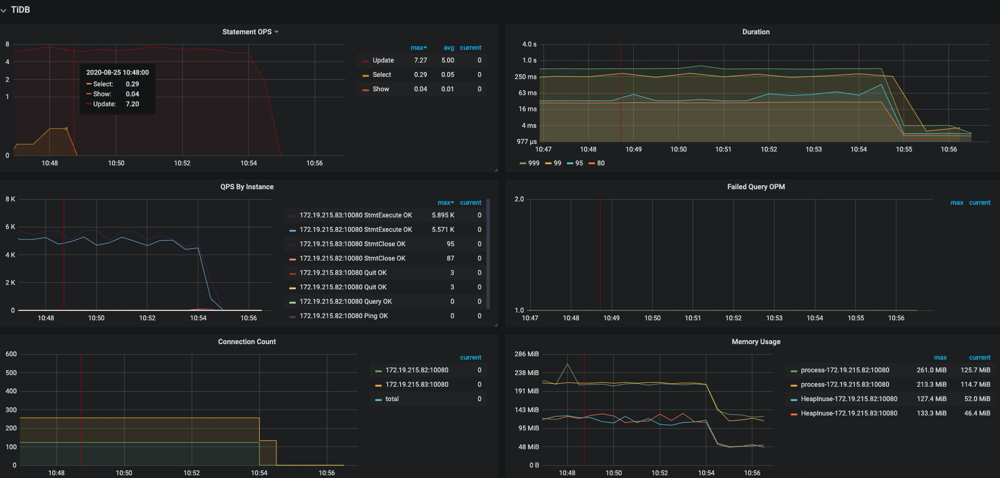

<center>oltp_update_index tikv 指标</center>

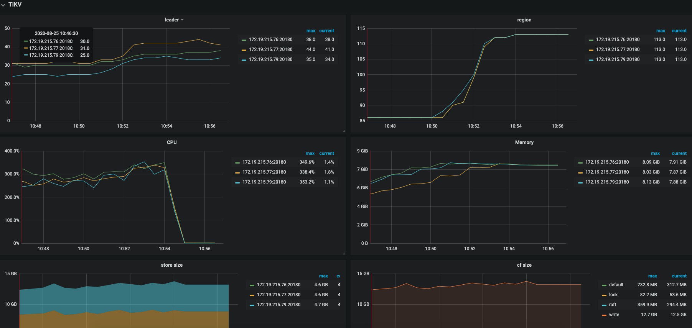


### 执行 oltp_read_only
```
sysbench --config-file=config oltp_read_only --threads=256 --tables=32 --table-size=500000 run
sysbench 1.0.20 (using bundled LuaJIT 2.1.0-beta2)

Running the test with following options:
Number of threads: 256
Report intermediate results every 10 second(s)
Initializing random number generator from current time


Initializing worker threads...


Threads started!

[ 10s ] thds: 256 tps: 2472.35 qps: 39738.64 (r/w/o: 34770.33/0.00/4968.30) lat (ms,95%): 153.02 err/s: 0.00 reconn/s: 0.00
......
......
......
[ 600s ] thds: 256 tps: 2519.05 qps: 40314.68 (r/w/o: 35276.98/0.00/5037.70) lat (ms,95%): 150.29 err/s: 0.00 reconn/s: 0.00
SQL statistics:
    queries performed:
        read:                            21045388
        write:                           0
        other:                           3006484
        total:                           24051872
    transactions:                        1503242 (2504.49 per sec.)
    queries:                             24051872 (40071.86 per sec.)
    ignored errors:                      0      (0.00 per sec.)
    reconnects:                          0      (0.00 per sec.)

General statistics:
    total time:                          600.2169s
    total number of events:              1503242

Latency (ms):
         min:                                   11.72
         avg:                                  102.19
         max:                                  319.29
         95th percentile:                      150.29
         sum:                            153614637.82

Threads fairness:
    events (avg/stddev):           5872.0391/1090.60
    execution time (avg/stddev):   600.0572/0.05
```

<center>oltp_read_only tidb 指标</center>

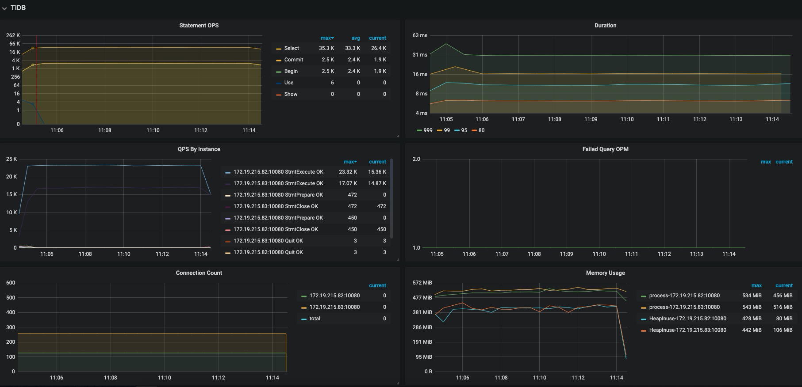

<center>oltp_read_only tikv 指标</center>

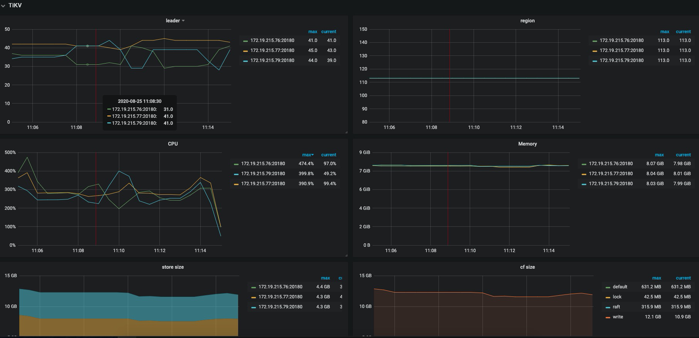


## 5. 使用 go-ycsb 做性能测试

### 导入数据
```shell
$ nohup ./bin/go-ycsb load mysql -P workloads/workloada -p recordcount=5000000 -p mysql.host=172.19.215.83 -p mysql.port=3390 --threads 256 2>&1  &
```
共导入5000000条记录

### workloada
```shell
$ nohup ./bin/go-ycsb run mysql -P workloads/workloada -p operationcount=5000000 -p mysql.host=172.19.215.83 -p mysql.port=3390 --threads 256 2>&1  &
```
<center>workloada tidb 指标</center>

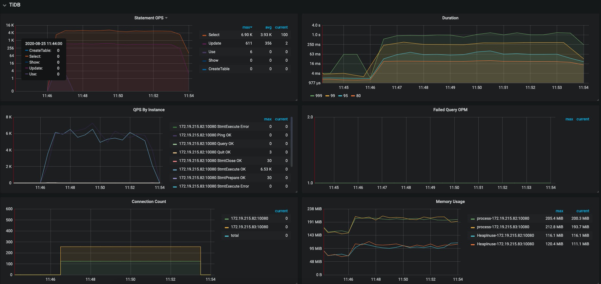

<center>workloada tikv 指标</center>

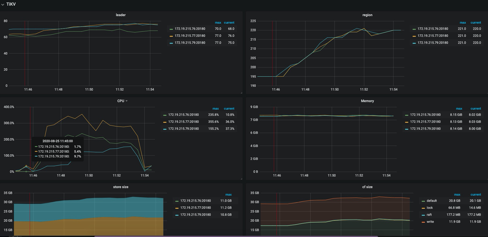


## 6. 使用 go-tpc 做性能测试

### 导入数据
```shell
$ nohup ./bin/go-tpc tpcc -H 172.19.215.83 -P 3390 -D tpcc --warehouses 300 prepare -T 256 2>&1  &
```

### tpcc
```shell
$ ./bin/go-tpc tpcc -H 172.19.215.83 -P 3390 -D tpcc --warehouses 300 run --time 10m -T 256
[Summary] DELIVERY - Takes(s): 2.3, Count: 66, TPM: 1734.2, Sum(ms): 21454, Avg(ms): 325, 90th(ms): 512, 99th(ms): 1000, 99.9th(ms): 1000
[Summary] NEW_ORDER - Takes(s): 2.6, Count: 562, TPM: 12803.2, Sum(ms): 77669, Avg(ms): 138, 90th(ms): 256, 99th(ms): 512, 99.9th(ms): 512
[Summary] NEW_ORDER_ERR - Takes(s): 2.6, Count: 127, TPM: 2893.2, Sum(ms): 1124, Avg(ms): 8, 90th(ms): 32, 99th(ms): 64, 99.9th(ms): 64
[Summary] ORDER_STATUS - Takes(s): 2.6, Count: 57, TPM: 1307.6, Sum(ms): 1261, Avg(ms): 22, 90th(ms): 64, 99th(ms): 112, 99.9th(ms): 112
[Summary] ORDER_STATUS_ERR - Takes(s): 2.6, Count: 9, TPM: 206.5, Sum(ms): 106, Avg(ms): 11, 90th(ms): 32, 99th(ms): 32, 99.9th(ms): 32
[Summary] PAYMENT - Takes(s): 2.6, Count: 591, TPM: 13785.1, Sum(ms): 60233, Avg(ms): 101, 90th(ms): 192, 99th(ms): 512, 99.9th(ms): 512
[Summary] PAYMENT_ERR - Takes(s): 2.6, Count: 120, TPM: 2799.0, Sum(ms): 6897, Avg(ms): 57, 90th(ms): 96, 99th(ms): 160, 99.9th(ms): 256
[Summary] STOCK_LEVEL - Takes(s): 2.6, Count: 55, TPM: 1261.6, Sum(ms): 1899, Avg(ms): 34, 90th(ms): 64, 99th(ms): 160, 99.9th(ms): 160
tpmC: 12802.9
```

## 6. 性能分析
在运行测试的过程中发现 tidb 的 CPU 使用率很高，tikv 节点的各项指标相对正常。

所以我将 tidb 增加了一台 4核8G 的机器重新进行测试。

以下是测试结果:

### 新的 tiup 拓扑
```yaml
global:
  user: "tidb"
  ssh_port: 22
  deploy_dir: "/tidb-deploy"
  data_dir: "/tidb-data"

pd_servers:
  - host: 172.19.215.91 # 8核 | 16GB | SSD 180GB
  - host: 172.19.215.88 # 8核 | 16GB | SSD 180GB
  - host: 172.19.215.90 # 8核 | 16GB | SSD 180GB

tidb_servers:
  - host: 172.19.215.83 # 8核 | 16GB | SSD 40GB
  - host: 172.19.215.82 # 8核 | 16GB | SSD 40GB
  - host: 172.19.215.93 # 4核 | 8GB  | SSD 40GB

tikv_servers:
  - host: 172.19.215.91 # 8核 | 16GB | SSD 180GB
  - host: 172.19.215.88 # 8核 | 16GB | SSD 180GB
  - host: 172.19.215.90 # 8核 | 16GB | SSD 180GB

monitoring_servers:
  - host: 172.19.215.85 # 4核 | 4GB | SSD 40GB

grafana_servers:
  - host: 172.19.215.85 # 4核 | 4GB | SSD 40GB

alertmanager_servers:
  - host: 172.19.215.85 # 4核 | 4GB | SSD 40GB
```

### sysbench oltp_point_select
```shell
$ sysbench --config-file=config oltp_point_select --threads=256 --tables=32 --table-size=500000 run
sysbench 1.0.20 (using bundled LuaJIT 2.1.0-beta2)

Running the test with following options:
Number of threads: 256
Report intermediate results every 10 second(s)
Initializing random number generator from current time


Initializing worker threads...

Threads started!

[ 10s ] thds: 256 tps: 104216.46 qps: 104216.46 (r/w/o: 104216.46/0.00/0.00) lat (ms,95%): 8.43 err/s: 0.00 reconn/s: 0.00
......
......
......
[ 600s ] thds: 256 tps: 109248.84 qps: 109248.84 (r/w/o: 109248.84/0.00/0.00) lat (ms,95%): 8.13 err/s: 0.00 reconn/s: 0.00
SQL statistics:
    queries performed:
        read:                            64848134
        write:                           0
        other:                           0
        total:                           64848134
    transactions:                        64848134 (108066.60 per sec.)
    queries:                             64848134 (108066.60 per sec.)
    ignored errors:                      0      (0.00 per sec.)
    reconnects:                          0      (0.00 per sec.)

General statistics:
    total time:                          600.0740s
    total number of events:              64848134

Latency (ms):
         min:                                    0.27
         avg:                                    2.37
         max:                                  190.73
         95th percentile:                        8.28
         sum:                            153553917.80

Threads fairness:
    events (avg/stddev):           253313.0234/138348.56
    execution time (avg/stddev):   599.8200/0.15
```

<center>oltp_point_select 运行时机器负载</center>

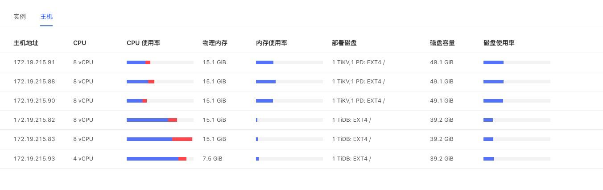

<center>oltp_point_select tidb 指标</center>

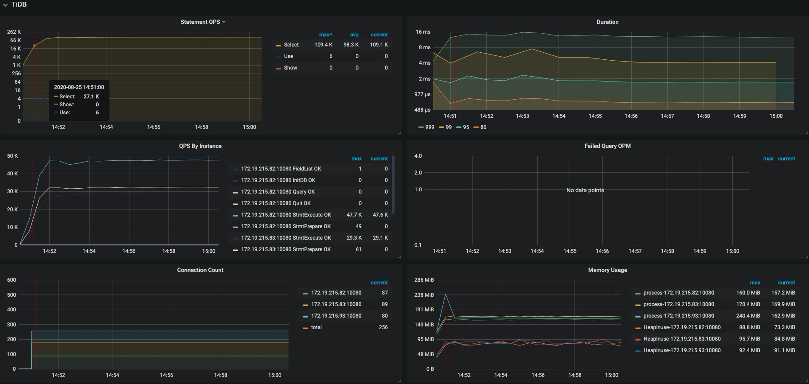

<center>oltp_point_select tikv 指标</center>

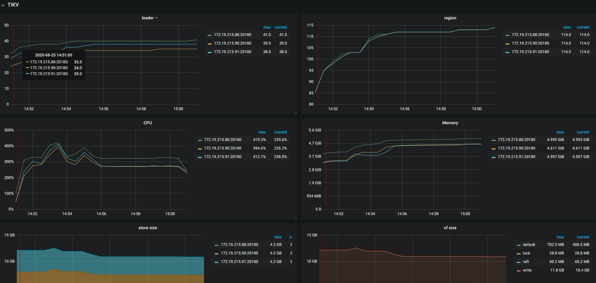


### sysbench oltp_update_index
```shell
$ sysbench --config-file=config oltp_update_index --threads=256 --tables=32 --table-size=500000 run
sysbench 1.0.20 (using bundled LuaJIT 2.1.0-beta2)

Running the test with following options:
Number of threads: 256
Report intermediate results every 10 second(s)
Initializing random number generator from current time


Initializing worker threads...

Threads started!

[ 10s ] thds: 256 tps: 11383.16 qps: 11383.16 (r/w/o: 0.00/11344.27/38.89) lat (ms,95%): 36.24 err/s: 0.00 reconn/s: 0.00
......
......
......
[ 600s ] thds: 256 tps: 11320.10 qps: 11320.10 (r/w/o: 0.00/11285.27/34.83) lat (ms,95%): 30.26 err/s: 0.00 reconn/s: 0.00
SQL statistics:
    queries performed:
        read:                            0
        write:                           6527575
        other:                           20890
        total:                           6548465
    transactions:                        6548465 (10911.16 per sec.)
    queries:                             6548465 (10911.16 per sec.)
    ignored errors:                      0      (0.00 per sec.)
    reconnects:                          0      (0.00 per sec.)

General statistics:
    total time:                          600.1605s
    total number of events:              6548465

Latency (ms):
         min:                                    0.47
         avg:                                   23.46
         max:                                 3651.61
         95th percentile:                       31.94
         sum:                            153603290.18

Threads fairness:
    events (avg/stddev):           25579.9414/224.97
    execution time (avg/stddev):   600.0129/0.02
```

<center>oltp_update_index tidb 指标</center>

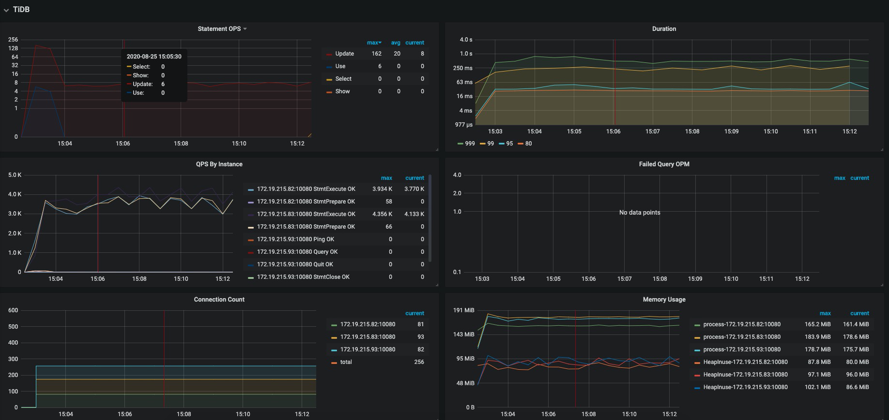

<center>oltp_update_index tikv 指标</center>

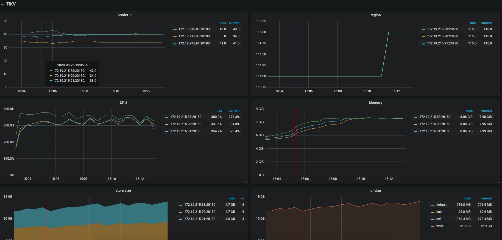


### oltp_read_only
```shell
$ sysbench --config-file=config oltp_read_only --threads=256 --tables=32 --table-size=500000 run
sysbench 1.0.20 (using bundled LuaJIT 2.1.0-beta2)

Running the test with following options:
Number of threads: 256
Report intermediate results every 10 second(s)
Initializing random number generator from current time


Initializing worker threads...

Threads started!

[ 10s ] thds: 256 tps: 3014.37 qps: 48404.80 (r/w/o: 42352.66/0.00/6052.14) lat (ms,95%): 132.49 err/s: 0.00 reconn/s: 0.00
......
......
......
[ 600s ] thds: 256 tps: 3074.65 qps: 49166.74 (r/w/o: 43018.25/0.00/6148.49) lat (ms,95%): 132.49 err/s: 0.00 reconn/s: 0.00
SQL statistics:
    queries performed:
        read:                            25534432
        write:                           0
        other:                           3647776
        total:                           29182208
    transactions:                        1823888 (3038.64 per sec.)
    queries:                             29182208 (48618.22 per sec.)
    ignored errors:                      0      (0.00 per sec.)
    reconnects:                          0      (0.00 per sec.)

General statistics:
    total time:                          600.2303s
    total number of events:              1823888

Latency (ms):
         min:                                   12.47
         avg:                                   84.22
         max:                                  463.88
         95th percentile:                      134.90
         sum:                            153613223.77

Threads fairness:
    events (avg/stddev):           7124.5625/2045.18
    execution time (avg/stddev):   600.0517/0.05
```

<center>oltp_read_only 运行时机器负载</center>

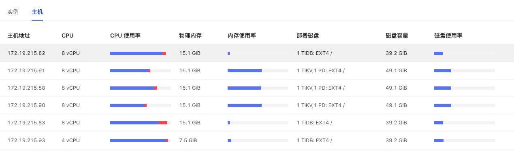


<center>oltp_read_only tidb 指标</center>

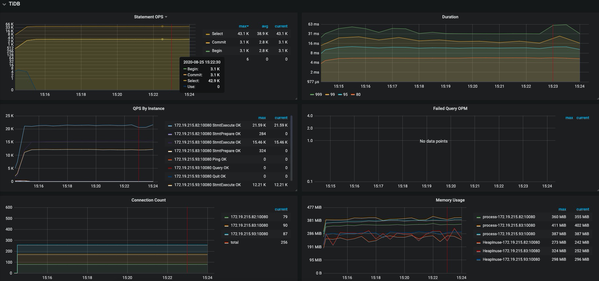

<center>oltp_read_only tikv 指标</center>

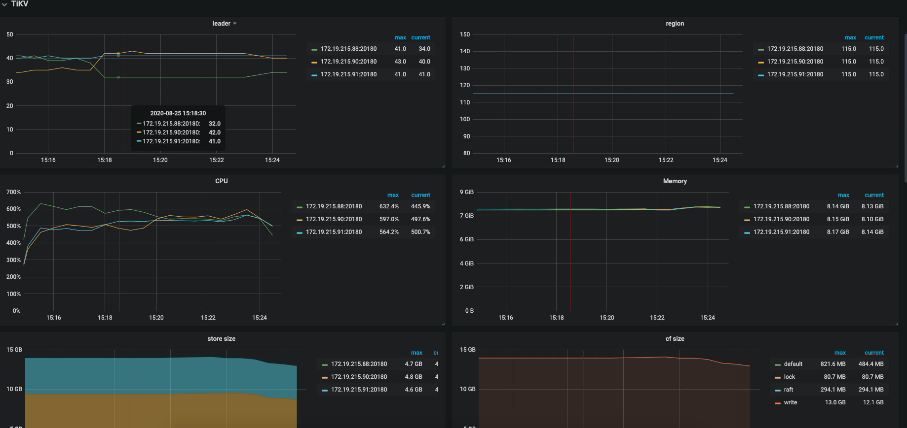

通过对比测试发现 新增一台 tidb 节点查询性能有明显提升。

但是因为机器数量限制，我只新增了一台 4核8G 节点

并且 我把 haproxy 部署在一台 tidb 的节点上 也导致这台机器性能根不上。

